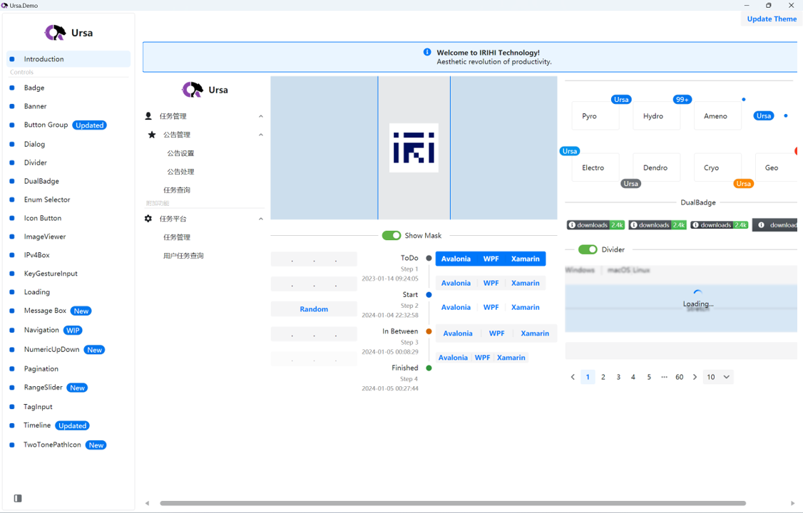
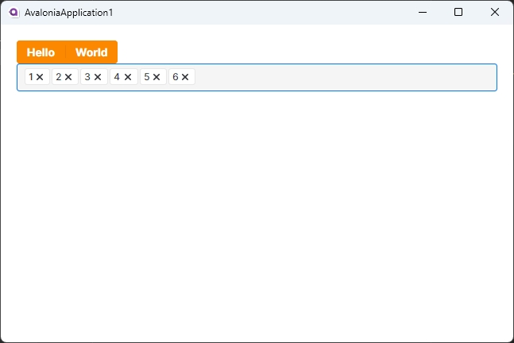

# Ursa

<p align="center">
    
</p>

Ursa is a UI library for building cross-platform UIs with Avalonia UI.



## How to use
1. Ursa

Add nuget package:
```bash
dotnet add package Irihi.Ursa
```

2. Ursa.Themes.Semi

To make Ursa controls show up in your application, you need to reference to a theme package designed for Ursa.
Ursa.Themes.Semi is a theme package for Ursa inspired by Semi Design. You can add it to your project by following steps.

Add nuget package:
```bash
dotnet add package Semi.Avalonia
dotnet add package Irihi.Ursa.Themes.Semi
```

Include Styles in application:
```xaml
<Application...
    xmlns:semi="https://irihi.tech/semi"
    xmlns:u-semi="https://irihi.tech/ursa/themes/semi"
    ....>

    <Application.Styles>
        <semi:SemiTheme Locale="zh-CN" />
        <u-semi:SemiTheme Locale="zh-CN"/>
    </Application.Styles>
```


You can now use Ursa controls in your Avalonia Application.
```xaml
<Window
    ...
    xmlns:u="https://irihi.tech/ursa"
    ...>
    <StackPanel Margin="20">
        <u:ButtonGroup Classes="Solid Warning">
            <Button Content="Hello" />
            <Button Content="World" />
        </u:ButtonGroup>
        <u:TagInput />
    </StackPanel>
</Window>
```



## Support

We offer limited free community support for Semi Avalonia and Ursa. Please join our group via FeiShu(Lark)


