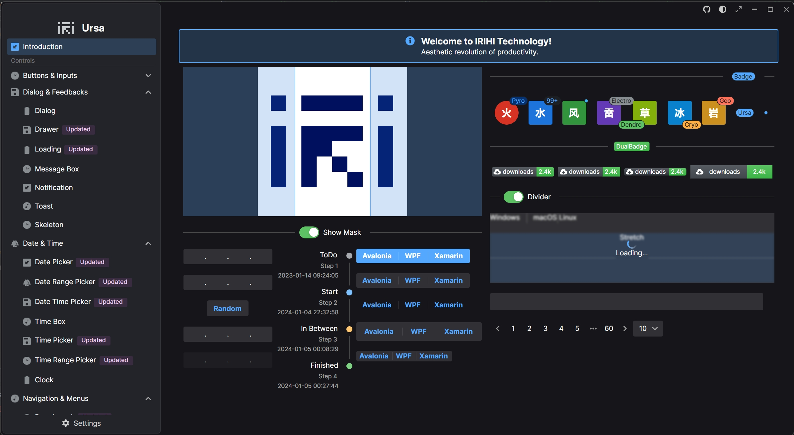

# Ursa

<p align="center">
    
</p>

[](https://www.nuget.org/packages/Irihi.Ursa/)
[](https://www.nuget.org/packages/Irihi.Ursa/)
[](https://gitcode.com/IRIHI_Technology/Ursa.Avalonia)

Ursa is an enterprise level UI library for building cross-platform applications with Avalonia UI.



## .NET Foundation

This project is supported by the [.NET Foundation](https://dotnetfoundation.org).

## Get Started

1. Ursa

Add nuget package:
```bash
dotnet add package Irihi.Ursa
```

2. Ursa.Themes.Semi

To make Ursa controls show up in your application, you need to reference to a theme package designed for Ursa.
Ursa.Themes.Semi is a theme package for Ursa inspired by Semi Design. You can add it to your project by following steps.

Add nuget package:
```bash
dotnet add package Semi.Avalonia
dotnet add package Irihi.Ursa.Themes.Semi
```

Include Styles in application:
```xaml
<Application...
    xmlns:semi="https://irihi.tech/semi"
    xmlns:u-semi="https://irihi.tech/ursa/themes/semi"
    ....>

    <Application.Styles>
        <semi:SemiTheme Locale="zh-CN" />
        <u-semi:SemiTheme Locale="zh-CN"/>
    </Application.Styles>
```


You can now use Ursa controls in your Avalonia Application.
```xaml
<Window
    ...
    xmlns:u="https://irihi.tech/ursa"
    ...>
    <StackPanel Margin="20">
        <u:TagInput />
    </StackPanel>
</Window>
```


## Code of Conduct

This project has adopted the code of conduct defined by the Contributor Covenant to clarify expected behavior in our community.
For more information see the [.NET Foundation Code of Conduct](https://dotnetfoundation.org/code-of-conduct).

## Compatibility Notice
Ursa currently is compatible with both Avalonia 11.1.x and 11.2.x, but specifically does not support Avalonia 11.2.0.

## Extensions

### Prism Extension
If you need to integrate Ursa with Prism.Avalonia, you can use the Irihi.Ursa.PrismExtension package. This package provide Dialog related services to utilize Ursa Dialogs with Prism flavor. 

### ReactiveUI Extension
If need to integrate Ursa with Avalonia.ReactiveUI, you can use the Irihi.Ursa.ReactiveUIExtension package. This package implements the ReactiveUI versions of UrsaWindow and UrsaView. Please refer to [wiki](https://github.com/irihitech/Ursa.Avalonia/wiki/Ursa-ReactiveUI-extension) for detail. 

## Support

We offer limited free community support for Semi Avalonia and Ursa. Please join our group via FeiShu(Lark)

<p>
    
</p>

